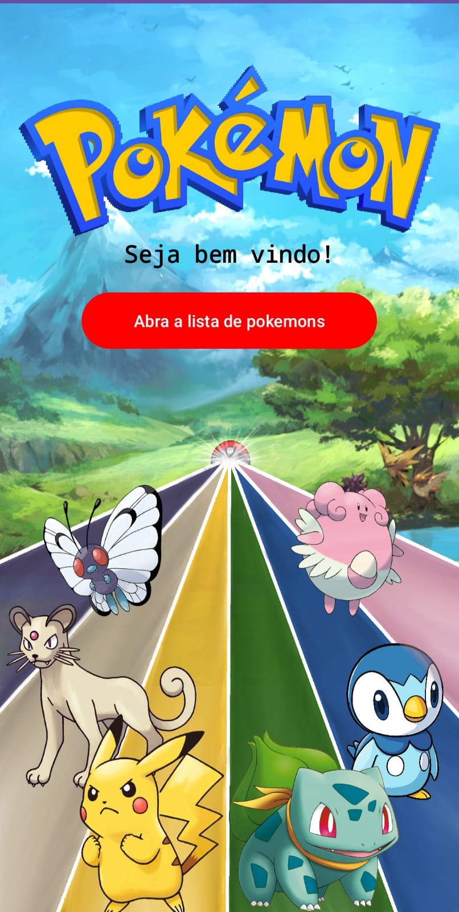
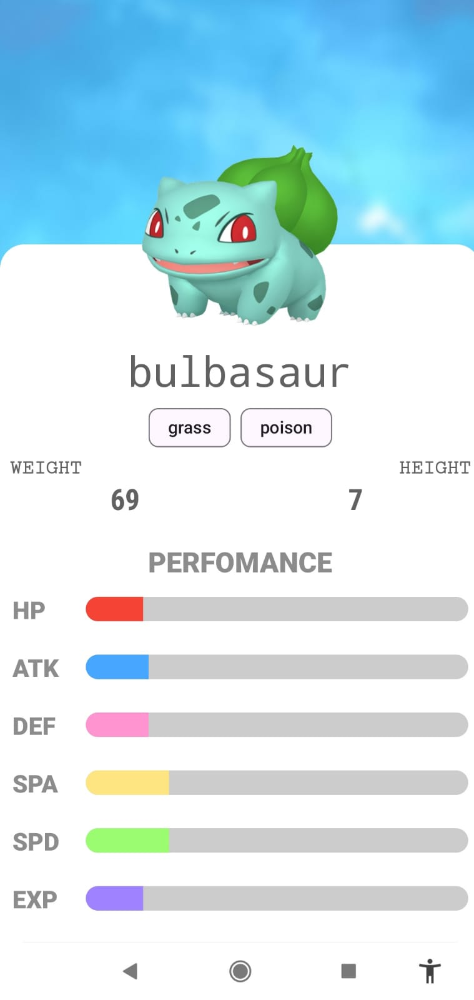
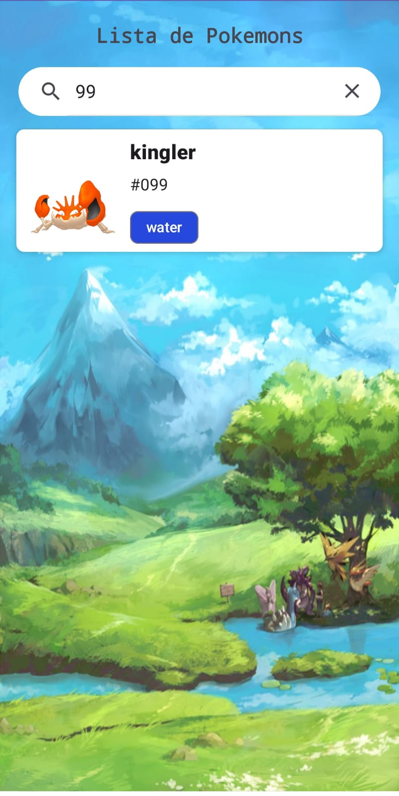
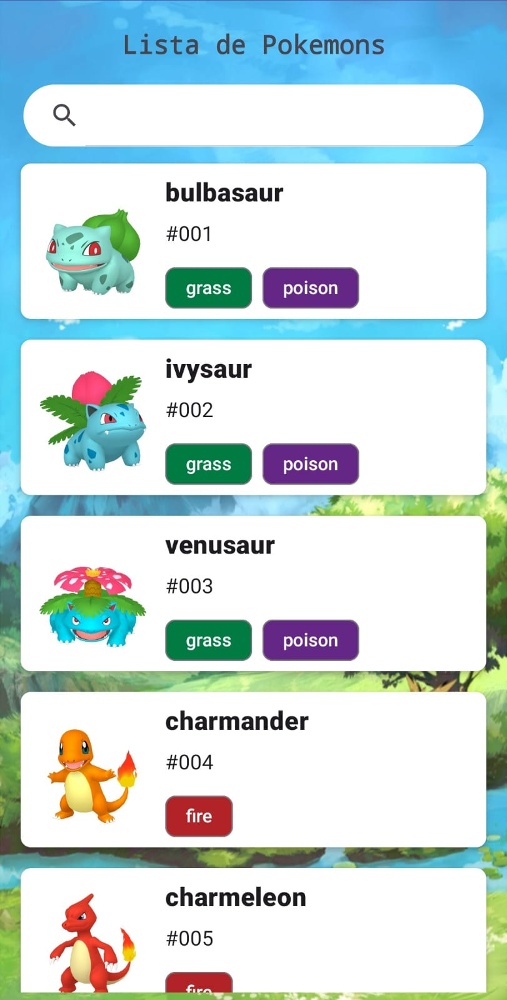

# App Pokémon API

## 🚀 Desenvolvimento de Aplicativo Pokémon com Kotlin e Arquitetura MVVM

Seja bem-vindo(a) ao repositório do **App Pokémon**, um aplicativo Android desenvolvido com **Kotlin** que consome a **Pokémon API** para trazer uma experiência rica e interativa para os fãs da franquia. Este projeto é um exemplo prático de boas práticas em desenvolvimento mobile, combinando tecnologias modernas e um design limpo.

---

## 🌟 Funcionalidades Principais

- **Exibição da lista completa de Pokémons**: Apresente todos os Pokémons com detalhes rápidos sobre suas habilidades.
- **Detalhes aprofundados**: Visualização detalhada de cada Pokémon, incluindo habilidades, evoluções e estatísticas em gráficos interativos.
- **Filtragem avançada**: Encontre Pokémons rapidamente pelo nome ou ID.

---

## 🔧 Tecnologias Utilizadas

- **Kotlin**: Linguagem principal do desenvolvimento Android.
- **Arquitetura MVVM**: Garantindo separação de responsabilidades e um código escalável.
- **Hilt**: Para injeção de dependência, tornando o código modular e fácil de testar.
- **Retrofit**: Realização de requisições HTTP para consumir dados da Pokémon API.
- **Glide**: Carregamento e exibição de imagens de forma eficiente.

---

## 🌱 Aprendizados e Destaques

Durante o desenvolvimento deste aplicativo, tive a oportunidade de:

- Aplicar **arquitetura MVVM** para organizar o código de forma clara e separada.
- Usar **Hilt** para facilitar a injeção de dependências, otimizando o ciclo de desenvolvimento.
- Criar uma **UI fluida e intuitiva**, focada na experiência do usuário.
- Trabalhar com **gráficos interativos** para exibir estatísticas de forma visualmente atraente.

---

## 🎥 Demonstração

### 📹 Vídeo do App em Execução
[Link para o vídeo de demonstração](https://github.com/giuliano15/AppPokemonApi/issues/1#issue-2762509476/)

<p align="center">
  <video width="400" controls>
    <source src="https://github.com/giuliano15/AppPokemonApi/issues/1#issue-2762509476/" type="video/mp4">
    Seu navegador não suporta a exibição de vídeos.
  </video>
</p>


### 🖼 Imagens do App

<p align="center">
  
  
  
  
</p>


## 🔄 Como Executar o Projeto

1. Clone o repositório:

   ```bash
   git clone https://github.com/giuliano15/AppPokemonApi.git
   ```

2. Abra o projeto no Android Studio.
3. Certifique-se de que o SDK do Android esteja configurado corretamente.
4. Construa o projeto e execute no emulador ou dispositivo físico.

---

## 🔧 Requisitos

- **Android Studio Arctic Fox ou superior**.
- **Versão do SDK do Android**: 21 ou superior.
- Conexão com a Internet para consumir a Pokémon API.

---

## 📢 Contato

Se você é fã de Pokémon ou tem interesse em desenvolvimento Android com Kotlin, fique à vontade para entrar em contato comigo:

- **LinkedIn**: [Giuliano Rodrigues](https://linkedin.com/in/giulrodrigues)
- **E-mail**: giulsilva@hotmail.com
---

Agradeço por explorar este repositório e espero que você se inspire neste projeto para suas próprias iniciativas! 🚀

